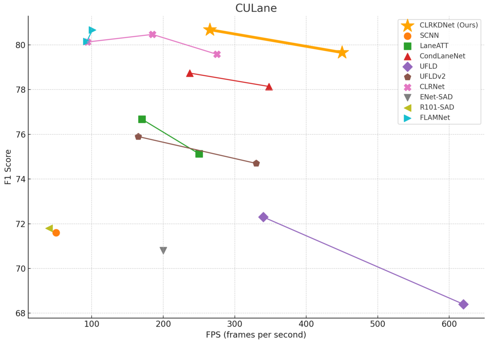

<div align="center">
  
[](https://paperswithcode.com/sota/lane-detection-on-culane?p=clrkdnet-speeding-up-lane-detection-with)

</div>


<div align="center">

# CLRKDNet: Speeding up Lane Detection with Knowledge Distillation

</div>

## Introduction


## Installation

### Prerequisites
Only test on Ubuntu18.04 and 20.04 with:
- Python >= 3.8 (tested with Python3.8)
- PyTorch >= 1.6 (tested with Pytorch1.6)
- CUDA (tested with cuda10.2)
- Other dependencies described in `requirements.txt`

### Create a conda virtual environment and activate it

```Shell
conda create -n clrkdnet python=3.8 -y
conda activate clrkdnet
```

### Install dependencies

```Shell
# Install pytorch firstly, the cudatoolkit version should be same in your system.

conda install pytorch torchvision cudatoolkit=10.1 -c pytorch

# Or you can install via pip
pip install torch==1.8.0 torchvision==0.9.0

# Install python packages
python setup.py build develop
```

### Data preparation

#### CULane
Download [CULane](https://xingangpan.github.io/projects/CULane.html). Then extract them to `$CULANEROOT`. Create link to `data` directory.

```Shell
cd $CLRKDNET_ROOT
mkdir -p data
ln -s $CULANEROOT data/CULane
```

For CULane, you should have structure like this:
```
$CULANEROOT/driver_xx_xxframe    # data folders x6
$CULANEROOT/laneseg_label_w16    # lane segmentation labels
$CULANEROOT/list                 # data lists
```


#### Tusimple
Download [Tusimple](https://github.com/TuSimple/tusimple-benchmark/issues/3). Then extract them to `$TUSIMPLEROOT`. Create link to `data` directory.

```Shell
cd $CLRKDNET_ROOT
mkdir -p data
ln -s $TUSIMPLEROOT data/tusimple
```

For Tusimple, you should have structure like this:
```
$TUSIMPLEROOT/clips # data folders
$TUSIMPLEROOT/lable_data_xxxx.json # label json file x4
$TUSIMPLEROOT/test_tasks_0627.json # test tasks json file
$TUSIMPLEROOT/test_label.json # test label json file

```

For Tusimple, the segmentation annotation is not provided, hence we need to generate segmentation from the json annotation. 

```Shell
python tools/generate_seg_tusimple.py --root $TUSIMPLEROOT
# this will generate seg_label directory
```

## Getting Started

[assets]: https://github.com/weiqingq/CLRKDNet/releases

### CULane

|   Backbone  | F1@50 |
| :---  |  :---:  |  
| [ResNet-18][assets]     |  79.66   |
| [DLA-34][assets]     |  80.68  |

### Validation
For testing, run
```Shell
python main.py [configs/path_to_your_config] --[test|validate] --load_from [path_to_your_model] --gpus [gpu_num]
```

For example, run
```Shell
python main.py configs/ResNet18_CULane.py --validate --load_from ResNet18_CULane.pth --gpus 0 
# ResNet18 Validation

python main.py configs/DLA_CULane.py --validate --load_from DLA34_CULane.pth --gpus 0
# DLA34 Validation 

```
To visualize result when testing, just add `--view`


### Speed Inference

For sample runtime inferencing, run 

```Shell
python sample_speed.py --config [configs/path_to_your_config] --load_from [path_to_your_model]

```

For example, run

```Shell
python sample_speed.py --config configs/ResNet18_CULane.py --load_from ResNet18_CULane.pth

python sample_speed.py --config configs/DLA_CULane.py --load_from DLA34_CULane.pth
```


## Results



## Acknowledgement
<!--ts-->
* [Turoad/CLRNet](https://github.com/Turoad/CLRNet)
* [open-mmlab/mmdetection](https://github.com/open-mmlab/mmdetection)
* [pytorch/vision](https://github.com/pytorch/vision)
* [Turoad/lanedet](https://github.com/Turoad/lanedet)
* [ZJULearning/resa](https://github.com/ZJULearning/resa)
* [cfzd/Ultra-Fast-Lane-Detection](https://github.com/cfzd/Ultra-Fast-Lane-Detection)
* [lucastabelini/LaneATT](https://github.com/lucastabelini/LaneATT)
* [aliyun/conditional-lane-detection](https://github.com/aliyun/conditional-lane-detection)
<!--te-->
